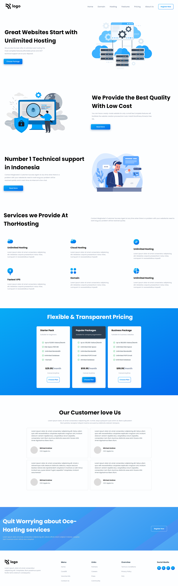

# Project 11: Hosting Landing Page

   

### Name:

> `Anshul Ghogre`

## Key Learnings from the project

- _Segregation of SVGs with the help of Figma._
- _Explored new properties such as repeating linear gradient and background text._

---

### Screenshots:-

---

> Time taken to complete this project: 10hrs

---

## [Live-Link](https://project-10-interior-design-landing-pg.netlify.app/)

---
